---
## Author
author:
  name: Дикач Анна Олеговна
  degrees: DSc
  orcid: 0000-0002-0877-7063
  email: 1132222009@rudn.ru
  affiliation:
    - name: Российский университет дружбы народов
      country: Российская Федерация
      postal-code: 117198
      city: Москва
      address: ул. Миклухо-Маклая, д. 6
## Title
title: Лабораторная работа №2
subtitle: Компьютерный практикум по статистическому анализу данных
license: CC BY
date: today
date-format: "YYYY-MM-DD" # Example: 2025-09-06
---

# Информация

## Докладчик

:::::::::::::: {.columns align=center}
::: {.column width="70%"}

  * Дикач Анна олеговна
  * Российский университет дружбы народов им. П. Лумумбы

:::
::: {.column width="30%"}

:::
::::::::::::::

# Цель

Основная цель работы — изучить несколько структур данных, реализованных в Julia,
научиться применять их и операции над ними для решения задач.

# Выполнение лабораторной работы

Кортеж (Tuple) -- структура данных (контейнер) в виде неизменяемой индексируемой
последовательности элементов какого-либо типа (элементы индексируются с единицы).

Словарь -- неупорядоченный набор связанных между собой по ключу данных.

Множество, как структура данных в Julia, соответствует множеству, как математическому объекту, то есть является неупорядоченной совокупностью элементов какого-либо типа. Возможные операции над множествами: объединение, пересечение, разность; принадлежность элемента множеству.

Массив — коллекция упорядоченных элементов, размещённая в многомерной сетке. Векторы и матрицы являются частными случаями массивов.

# Повторяю примеры из раздела 2.2. Начинаю с примеров кортежей.

{#fig-001 width=70%}

# Далее повторяю примеры работы с множествами.

{#fig-002 width=70%}

# Прописываю примеры для работы с массивами

{#fig-003 width=70%}

# Перехожу к выполнению заданий для самостоятельной работы. Целью 1 задания было найти Р при заданных множествах

{#fig-004 width=70%}

#  Далее привела примеры с выполнением операций над множествами элементов разных типов (задание 2)

{#fig-005 width=70%}

# Задание 3 подрузамевало создание массивов и векторов разными способами. 3.1. 

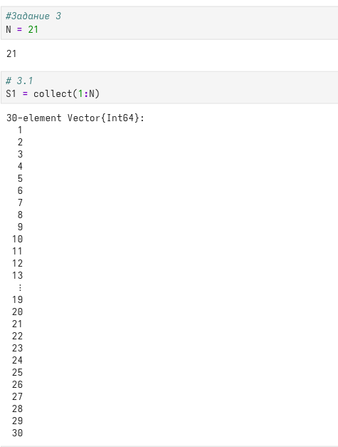{#fig-006 width=70%}

# 3.2 

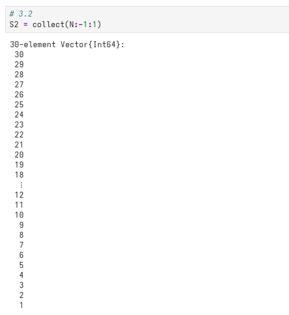{#fig-007 width=70%}

# 3.3 

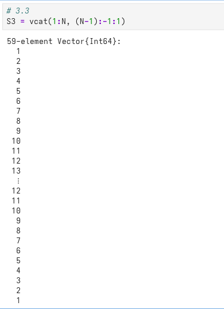{#fig-008 width=70%}

# 3.7 

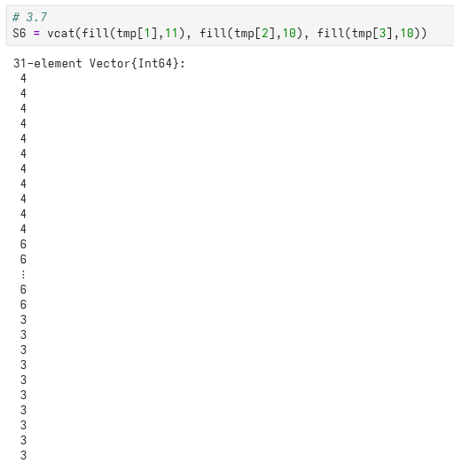{#fig-010 width=70%}

# 3.8

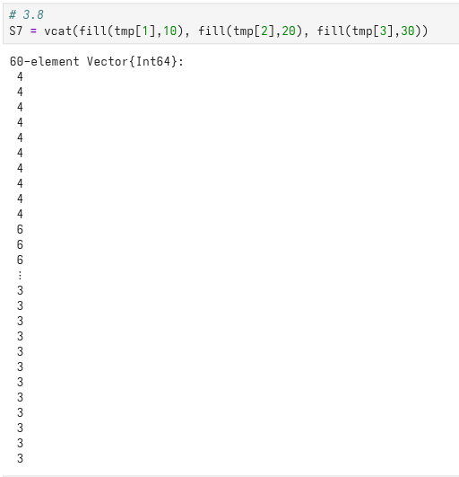{#fig-011 width=70%}

# 3.9, 3.10

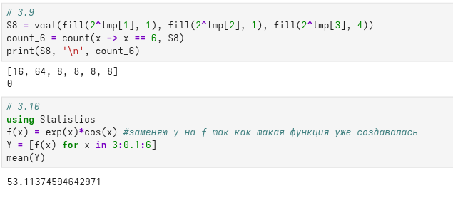{#fig-012 width=70%}

# 3.11

{#fig-013 width=70%}

# 3.12

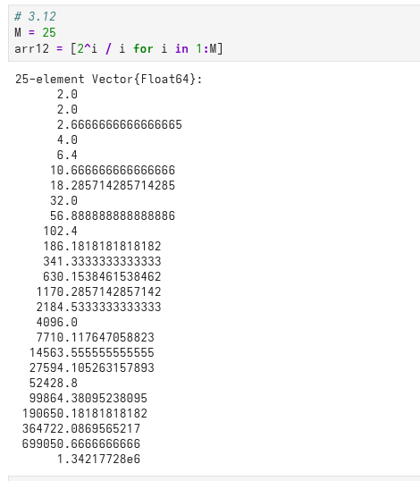{#fig-014 width=70%}

# 3.13

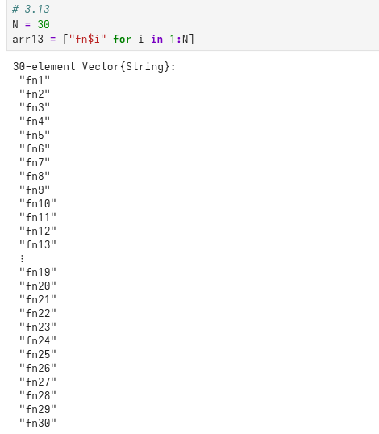{#fig-015 width=70%}

# 3.14 (1)

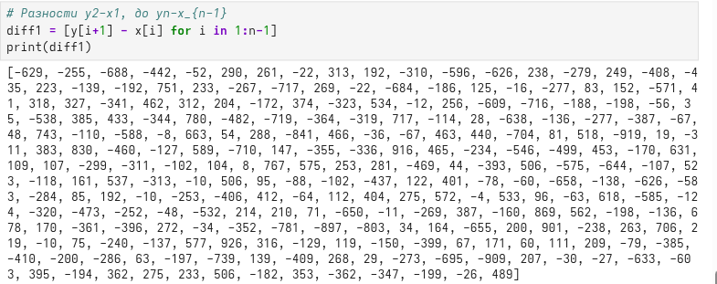{#fig-017 width=70%}

# 3.14 (2)

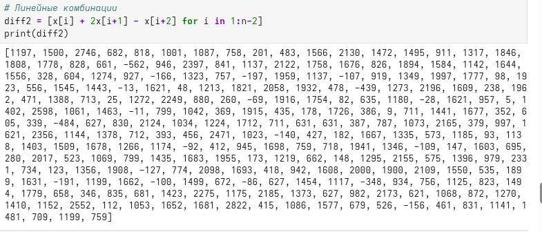{#fig-018 width=70%}

# 3.14 (3)

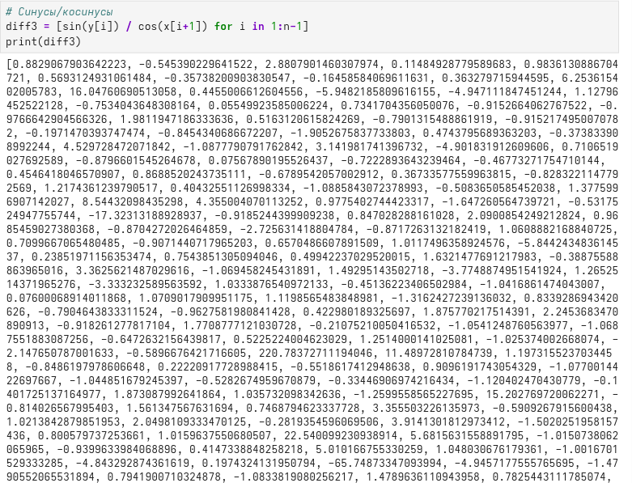{#fig-019 width=70%}

# 3.14 (4)

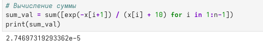{#fig-020 width=70%} 

# Задание 4

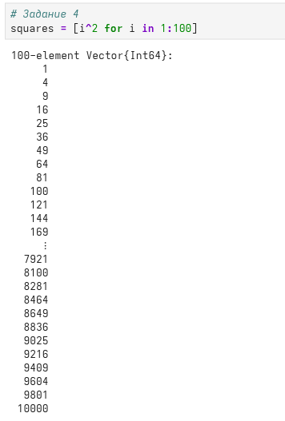{#fig-027 width=70%}

# Задание 5

{#fig-028 width=70%}

# Задание 6

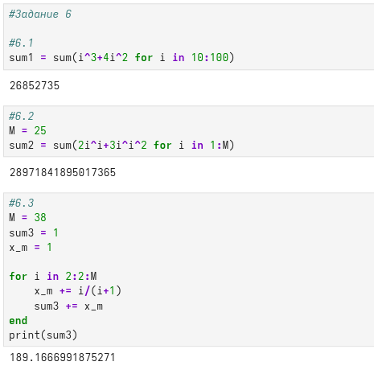{#fig-029 width=70%}

# Вывод

Изучила несколько структур данных и научилась их применять для решения задач.
