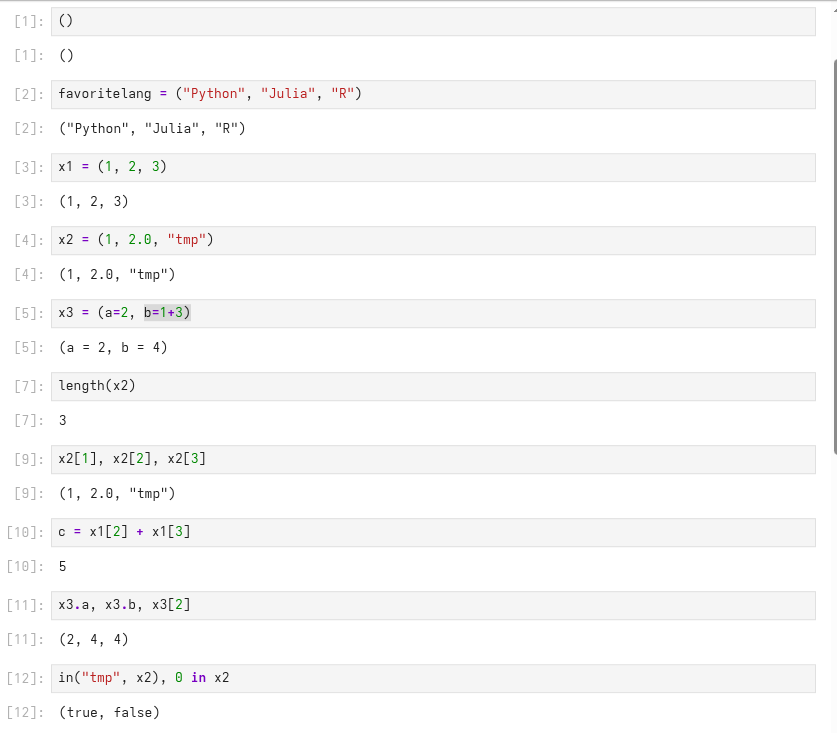
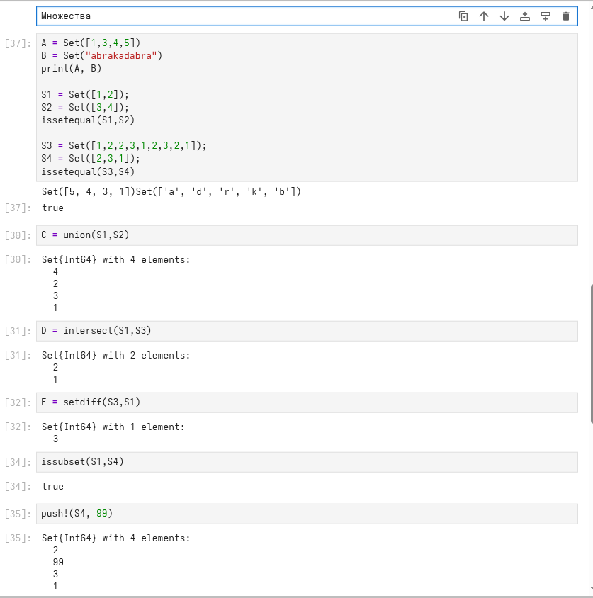
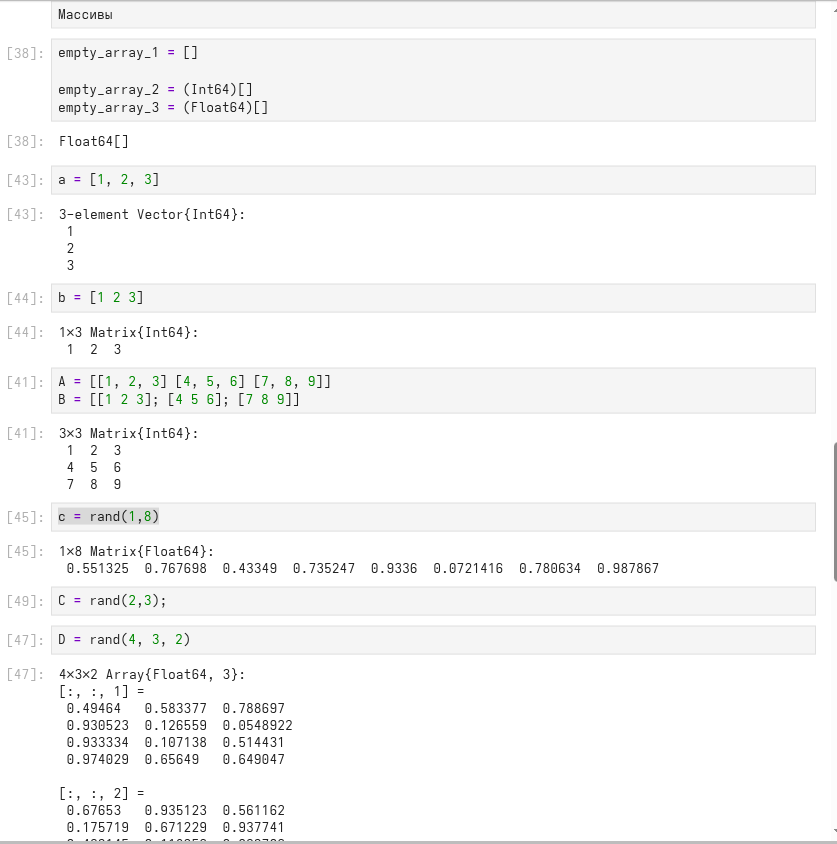
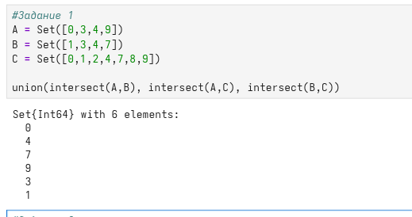
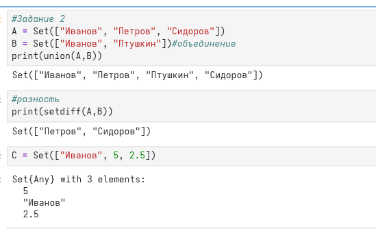
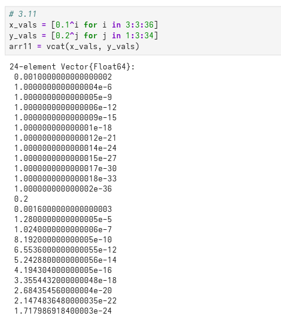
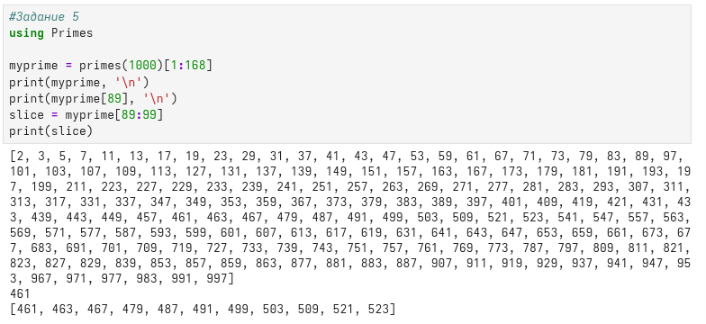

---
## Author
author:
  name: Дикач Анна Олеговна
  degrees: DSc
  orcid: 0000-0002-0877-7063
  email: 1132222009@rudn.ru
  affiliation:
    - name: Российский университет дружбы народов
      country: Российская Федерация
      postal-code: 117198
      city: Москва
      address: ул. Миклухо-Маклая, д. 6

## Title
title: "Лабораторная работа №2"
subtitle: "Компьютерный практикум по статистическому анализу данных"
license: "CC BY"
---

# Цель работы

Основная цель работы — изучить несколько структур данных, реализованных в Julia,
научиться применять их и операции над ними для решения задач.

# Задание

1. Используя Jupyter Lab, повторите примеры из раздела 2.2.
2. Выполните задания для самостоятельной работы (раздел 2.4).

# Выполнение лабораторной работы

1. Повторяю примеры из раздела 2.2. Начинаю с примеров кортежей ([рис. @fig-001]).

{#fig-001 width=70%}

2. Далее повторяю примеры работы с множествами ([рис. @fig-002]).

{#fig-002 width=70%}

3. Прописываю примеры для работы с массивами ([рис. @fig-003]).

{#fig-003 width=70%}

4. Перехожу к выполнению заданий для самостоятельной работы. Целью 1 задания было найти Р при заданных множествах ([рис. @fig-004]).

{#fig-004 width=70%}

5. Далее привела примеры с выполнением операций над множествами элементов разных типов (задание 2) ([рис. @fig-005]).

{#fig-005 width=70%}

6. Задание 3 подрузамевало создание массивов и векторов разными способами.

7. 3.1 ([рис. @fig-006]).

{#fig-006 width=70%}

8. 3.2 ([рис. @fig-007]).

{#fig-007 width=70%}

9. 3.3 ([рис. @fig-008]).

{#fig-008 width=70%}

10. 3.7 ([рис. @fig-010]).

{#fig-010 width=70%}

11. 3.8 ([рис. @fig-011]).

{#fig-011 width=70%}

12. 3.9, 3.10 ([рис. @fig-012]).

{#fig-012 width=70%}

13. 3.11 ([рис. @fig-013]).

{#fig-013 width=70%}

14. 3.12 ([рис. @fig-014]).

{#fig-014 width=70%}

15. 3.13 ([рис. @fig-015]).

{#fig-015 width=70%}

16. 3.14 (1) ([рис. @fig-017]).

{#fig-017 width=70%}

17. 3.14 (2) ([рис. @fig-018]).

{#fig-018 width=70%}

18. 3.14 (3) ([рис. @fig-019]).

{#fig-019 width=70%}

19. 3.14 (4) ([рис. @fig-020]).

{#fig-020 width=70%} 

20. Задание 4 ([рис. @fig-027]).

{#fig-027 width=70%}

21. Задание 5 ([рис. @fig-028]).

{#fig-028 width=70%}

22. Задание 6 ([рис. @fig-029]).

{#fig-029 width=70%}

# Выводы

Изучила несколько структур данных и научилась их применять для решения задач.
 
# Список литературы{.unnumbered}

::: {#refs}
:::
