---
# Preamble

## Author
author:
  name: Дикач Анна Олеговна
  email: 1132222009@pfur.ru
  affiliation:
    - name: Российский университет дружбы народов
      country: Российская Федерация
      postal-code: 117198
      city: Москва
      address: ул. Миклухо-Маклая, д. 6
## Title
title: Лабораторная работа №3
subtitle: Компьютерный практикум по статистическому анализу данных
date: 2025-10-08
## Generic options
lang: ru-RU
crossref:
  lof-title: Список иллюстраций
  lot-title: Список таблиц
  lol-title: Листинги
## Formats
format:
### Pdf output format
  beamer:
    toc: true
    toc-title: Содержание
    number-sections: true
    colorlinks: false
    toc-depth: 2
    slide_level: 2
    aspectratio: 169
    section-titles: true
    theme: metropolis
    colortheme: metropolis
    themeoptions: progressbar=frametitle,sectionpage=progressbar,numbering=fraction
    incremental: false
    mainfont: "IBM Plex Serif"
    sansfont: "IBM Plex Sans"
    monofont: "IBM Plex Mono"
#### Language
    babel-lang: russian
    babel-otherlangs: english
### Html output
  revealjs:
    transition: slide
    margin: 0.2
    smaller: false
    output-ext: html
    theme: beige
    logo: _resources/image/logo_rudn.png
---

# Информация

## Докладчик

* Дикач Анна Олеговна
* Группа: НПИбд-01-22
* Российский университет дружбы народов им. П. Лумумбы

# Вводная часть

## Цель работы

- Основная цель работы -- освоить применение циклов функций и сторонних для Julia пакетов для решения задач линейной алгебры и работы с матрицами.

## Задание

1. Используя Jupyter Lab, повторите примеры из раздела 3.2.
2. Выполните задания для самостоятельной работы (раздел 3.4)

# Выполнение лабораторной работы

## Примеры

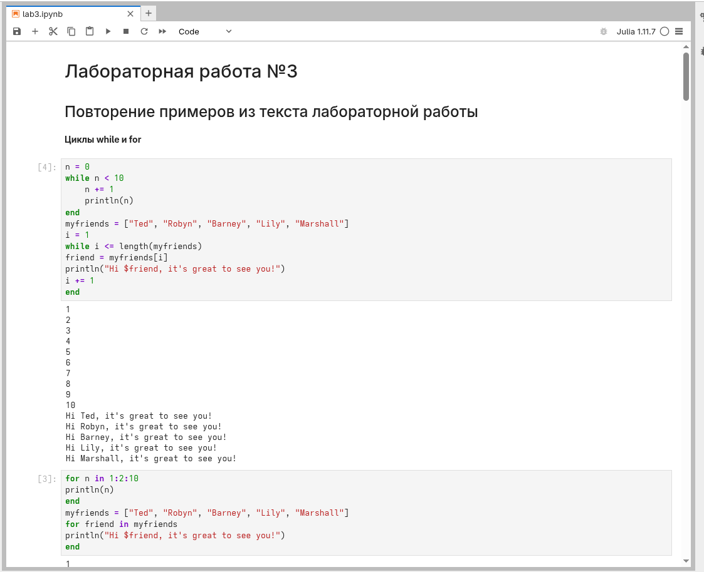{#fig-001 width=45%}

## Примеры

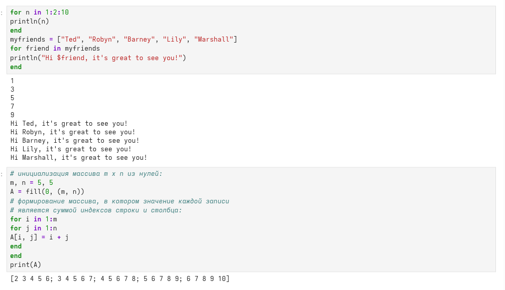{#fig-002 width=45%}

## Примеры

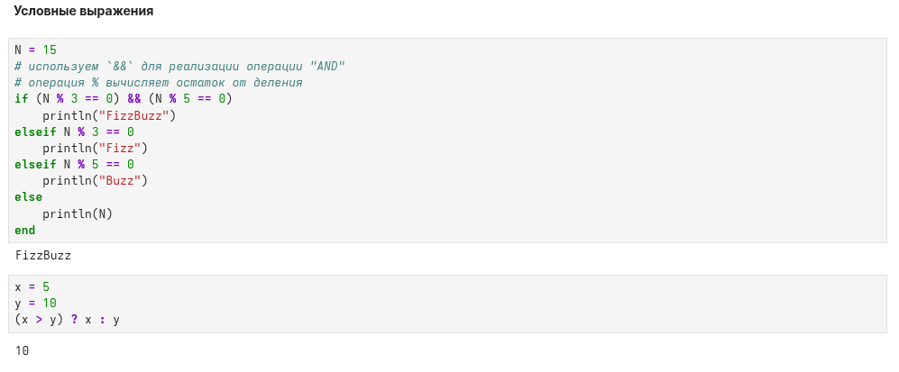{#fig-003 width=70%}

## Примеры

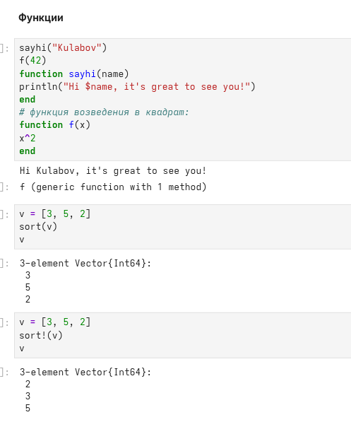{#fig-004 width=70%}

## Примеры

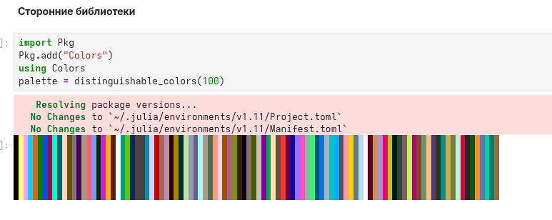{#fig-005 width=70%}

# Задания самостоятельной работы

## Задание №1

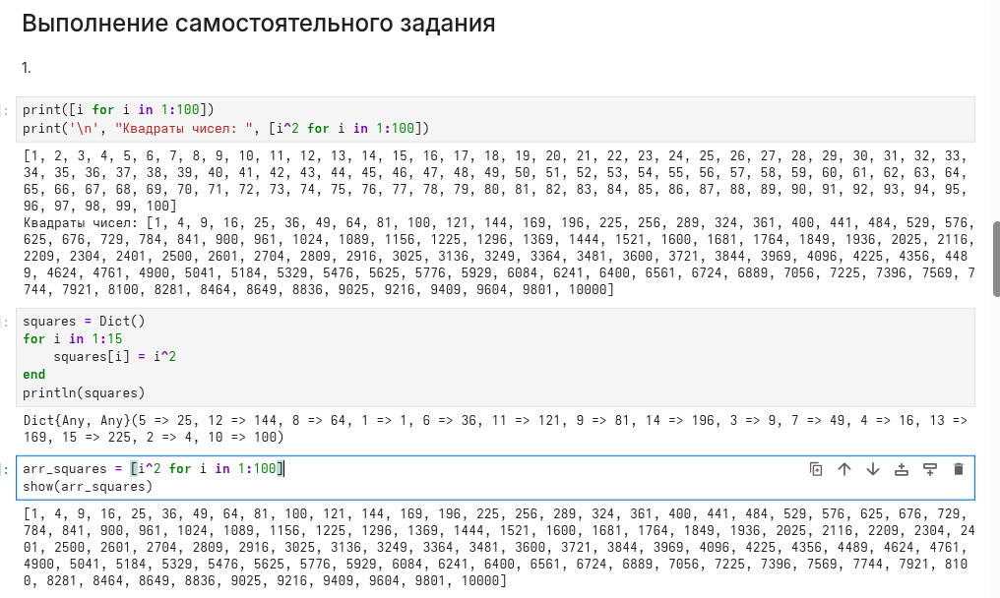{#fig-006 width=70%}

## Задания №2 и №3

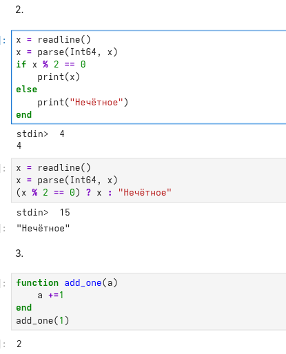{#fig-007 width=70%}

## Задание №4

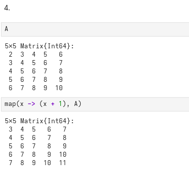{#fig-008 width=70%}

## Задания №5 и №6

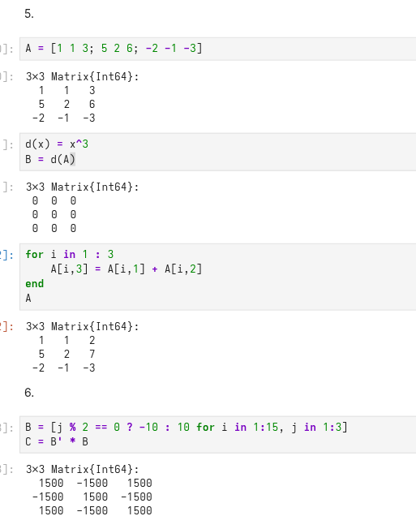{#fig-009 width=70%}

## Задание №7

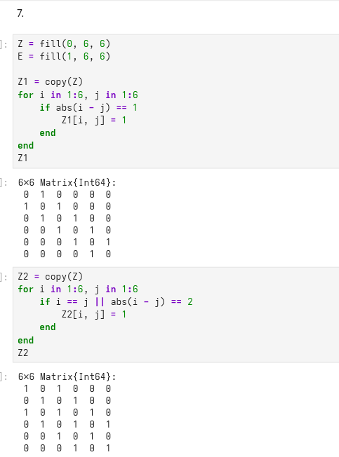{#fig-010 width=70%}

## Задание №7

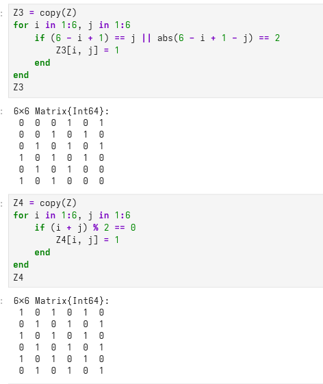{#fig-011 width=70%}

## Задание №8

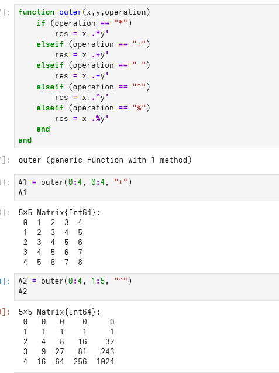{#fig-012 width=70%}

## Задание №8

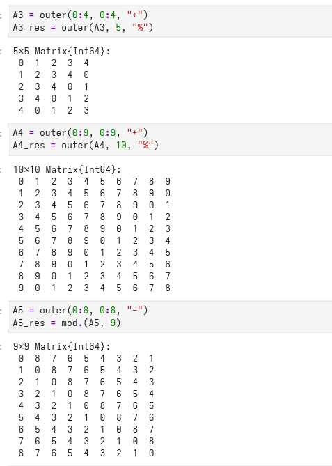{#fig-013 width=70%}

## Задания №9 и №10

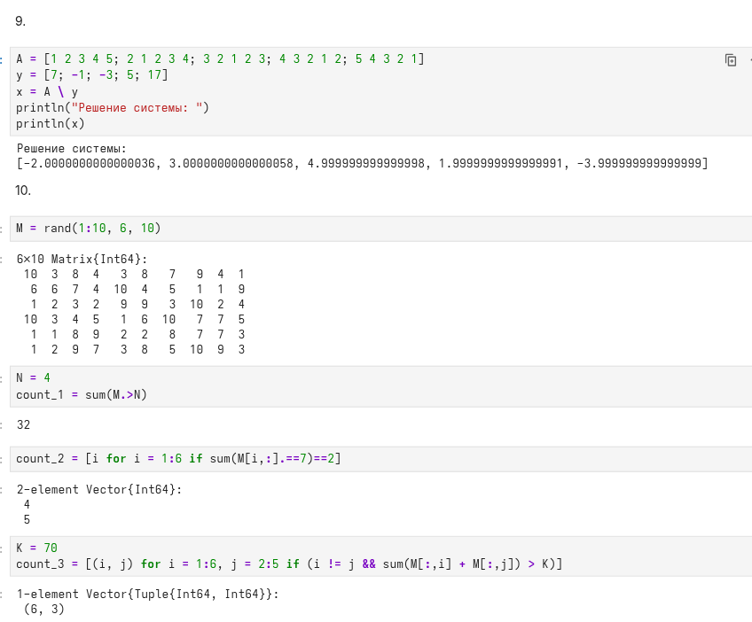{#fig-014 width=70%}

## Задание №11

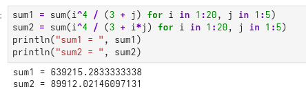{#fig-015 width=70%}
## Выводы

В резульате выполнения данной лабораторной работы я освоила применение циклов функций и сторонних для Julia пакетов для решение задач линейной алегбры и работы с матрицами.